```{r setup, include=F}
knitr::opts_chunk$set(echo = F, message = F, warning = F)

box::use(
  dplyr[`%>%`]
)

source('R/funcs.R')

# # style file
# styles <- readLines('https://raw.githubusercontent.com/tbep-tech/css-styling/master/styles.css')
# writeLines(styles, 'styles.css')

data('trnpts', package = 'tbeptools')
data('trnlns', package = 'tbeptools')
load(file = 'data/transect.RData')
load(file = 'data/transectocc.RData')
load(file = 'data/transectdem.RData')

fml <- 'Lato Light'

# for shiny server
sf::st_crs(trnpts) <- 4326

# remove transect not in transect data
trnpts <- trnpts %>% 
  dplyr::filter(TRAN_ID %in% unique(transect$Transect)) %>% 
  dplyr::filter(!duplicated(TRAN_ID))
trnlns <- trnlns %>% 
  dplyr::filter(Site %in% unique(transect$Transect)) %>% 
  dplyr::filter(Site %in% trnpts$TRAN_ID) %>% 
  dplyr::filter(!duplicated(Site))

# initial transect selection 
trninit <- 'S1T17'

# base map
m <- mapview::mapview(trnpts, homebutton = F, legend = F) %>% 
  .@map %>% 
  leaflet::clearMarkers() %>% 
  leaflet::addCircleMarkers(
    data = trnpts,
    layerId = ~TRAN_ID,
    stroke = TRUE,
    color = 'black',
    fill = TRUE,
    fillColor = 'grey',
    weight = 1,
    fillOpacity = 1,
    radius= 4,
    label = ~paste0('Transect ', TRAN_ID, ' (Agency responsible: ', MonAgency, ')')
  ) %>% 
  leaflet::addLabelOnlyMarkers(data = trnpts, ~0.99995 * LONG_DD, ~LAT_DD, label = ~TRAN_ID, labelOptions = leaflet::labelOptions(
    noHide = T, 
    direction = 'auto', 
    textOnly = T,
    textsize = '15px',
    style = list(
      'color' = 'darkgreen'
    )
  )) %>% 
  leaflet::addCircleMarkers(
    data = trnpts[trnpts$TRAN_ID %in% trninit, ],
    layerId = 'seltrn',
    stroke = TRUE,
    color = 'black',
    fill = TRUE,
    fillColor = 'red',
    weight = 1,
    fillOpacity = 1,
    radius= 6,
    label = ~paste0('Transect ', TRAN_ID, ' (Agency responsible: ', MonAgency, ')')
  ) 

# globals
segs <- c('OTB', 'HB', 'MTB', 'LTB', 'BCB')
spp <- c("Halodule", "Syringodium", "Thalassia", "Halophila", "Ruppia", "Caulerpa", "Dapis")
sppcol <- c('#ED90A4', '#CCA65A', '#7EBA68', '#6FB1E7', '#00C1B2', '#D400FF', '#8B2323')
demtrns <- sort(unique(transectdem$Transect))
rctsz <- 15
```

```{r reactives}
# matrix plot
matplo <- reactive({
  
  # input
  segsel1 <- input$segsel1
  yrssel1 <- input$yrssel1

  req(!is.null(segsel1))
  req(yrssel1[1] < yrssel1[2])
  
  tots <- ifelse('all' %in% segsel1, T, F)
  
  p <- tbeptools::show_transectmatrix(transectocc, bay_segment = segsel1, plotly = T, family = fml, neutral = T, yrrng = yrssel1, total = tots)
  
  return(p)
  
})

# ave freq occurrence plot
aveplo <- reactive({
  
  # input
  segsel1 <- input$segsel1
  sppsel1 <- input$sppsel1
  yrssel1 <- input$yrssel1
  
  req(!is.null(segsel1))
  req(!is.null(sppsel1))
  req(yrssel1[1] < yrssel1[2])
  
  tots <- ifelse('total' %in% sppsel1, T, F)
  sppsel1 <- sppsel1[!sppsel1 %in% 'total']
    
  p <- tbeptools::show_transectavespp(transectocc, bay_segment = segsel1, species = sppsel1, plotly = T, family = fml, yrrng = yrssel1, total = tots, sppcol = sppcol) %>% 
    plotly::layout(
      title = list(text = NA)
    )
  
  return(p)
  
})

# map selection
mapplo <- leaflet::leafletProxy('mapplo')
observeEvent(input$mapplo_marker_click, {
  
  # input
  trnsel1 <- input$mapplo_marker_click$id

  toadd <- trnpts %>% 
    dplyr::filter(TRAN_ID %in% trnsel1)

  mapplo <- mapplo %>%
    leaflet::removeMarker('seltrn') %>% 
    leaflet::addCircleMarkers(
      data = toadd,
      layerId = 'seltrn',
      stroke = TRUE,
      color = 'black',
      fill = TRUE,
      fillColor = 'red',
      weight = 1,
      fillOpacity = 1,
      radius= 6,
      label = ~paste0('Transect ', TRAN_ID, ' (Agency responsible: ', MonAgency, ')')
    ) 
  
})

# transect plot over time
trnplo <- reactive({
  
  # input
  trnsel1 <- input$mapplo_marker_click$id
  sppsel2 <- input$sppsel2
  yrssel2 <- input$yrssel2
  
  if(is.null(trnsel1))
    trnsel1 <- trninit
    
  p <- tbeptools::show_transect(transect, site = trnsel1, species = sppsel2, varplo = 'Abundance', plotly = T, base_size = 11, yrrng = yrssel2, sppcol = sppcol) %>% 
    plotly::layout(
      title = list(text = NA), 
      legend = list(title = list(text = 'Abundance (BB)'))
    )
  
  
  return(p)
  
})

# transect summary plot over time
sumplo <- reactive({
  
  # input
  trnsel1 <- input$mapplo_marker_click$id
  sppsel2 <- input$sppsel2
  yrssel2 <- input$yrssel2
  
  if(is.null(trnsel1))
    trnsel1 <- trninit
  
  p <- tbeptools::show_transectsum(transectocc, site = trnsel1, species = sppsel2, yrrng = yrssel2, sppcol = sppcol) %>% 
    plotly::layout(
      title = list(text = NA),
      legend = list(title = list(text = NA)),
      xaxis = list(title = list(text = 'Year'))
    )
  
  return(p)
  
})

# transect dem selection
demdat <- reactive({
  
  # input
  trnsel2 <- input$trnsel2

  out <- transectdem %>% 
    dplyr::filter(Transect %in% trnsel2)
  
  return(out)
  
})

# transect dem plot
demplo <- reactive({
  
  # input
  demdat <- demdat() 

  p <- ggplot2::ggplot(demdat, ggplot2::aes(y = Depth_dem, x = Site, group = Date)) + 
    ggplot2::geom_line() + 
    ggplot2::geom_point(ggplot2::aes(colour = patxt, size = meanabu)) + 
    ggplot2::facet_wrap(~Date) +
    ggplot2::scale_size('Mean abundance', range = c(2, 6)) + 
    ggplot2::scale_colour_manual('Seagrass', values = c('darkolivegreen4', 'indianred2')) + 
    ggplot2::theme_minimal(base_size = 18, base_family = fml) + 
    ggplot2::guides(colour = ggplot2::guide_legend(override.aes = list(size = 4))) +
    # theme(
      # legend.title = element_blank()
    # ) + 
    ggplot2::labs(
      x = 'Transect position (m)', 
      y = 'Depth, topographic (cm)'
    )
  
  return(p)
  
})

# transect dem plot
dtdemplo <- reactive({
  
  # input
  demdat <- demdat() 
  dtssel1 <- input$dtssel1

  req(dtssel1)

  # subset date data from demdat
  dt <- demdat %>% 
    dplyr::filter(Date %in% as.Date(dtssel1)) %>% 
    sf::st_set_geometry(NULL) #%>% 
    # filter(Site >= 0)

  # site estimate
  allests <- doc_est(dt) %>% 
    sens() 
  
  # edge estimate from site
  res <- allests %>% 
    dep_est(., dt)

  # abundance by site
  p1 <- ggplot2::ggplot() + 
    ggplot2::geom_point(data = dt, ggplot2::aes(x = Site, y = meanabu, group = Date, colour = patxt, size = -1 * Depth_dem)) + 
    ggplot2::scale_size('Depth (cm)', range = c(4, 9)) + 
    ggplot2::scale_colour_manual('Seagrass', values = c('darkolivegreen4', 'indianred2')) + 
    ggplot2::theme_minimal(base_size = 18, base_family = fml) + 
    ggplot2::guides(colour = ggplot2::guide_legend(override.aes = list(size = 4))) +
    ggplot2::labs(
      x = 'Transect position (m)', 
      y = 'Mean abundance'
    )
  
  # depth by site
  p2 <- ggplot2::ggplot() + 
    ggplot2::geom_line(data = dt, ggplot2::aes(x = Site, y = Depth_dem, group = Date)) +
    ggplot2::geom_point(data = dt, ggplot2::aes(x = Site, y = Depth_dem, group = Date, colour = patxt, size = meanabu)) +  
    ggplot2::scale_size('Mean abundance', range = c(4, 9)) + 
    ggplot2::scale_colour_manual('Seagrass', values = c('darkolivegreen4', 'indianred2')) +
    ggplot2::theme_minimal(base_size = 18, base_family = fml) + 
    ggplot2::guides(colour = ggplot2::guide_legend(override.aes = list(size = 4))) +
    ggplot2::labs(
      x = 'Transect position (m)', 
      y = 'Depth (cm)'
    )

  ttl <- 'Estimate not possible'
  
  # add site, edge estimates if available
  if(inherits(res, 'data.frame')){
    
    # logistic mod prediction for site
    preds <- attr(allests, 'preds')
  
    # linear mod function 
    est_fun <- attr(allests, 'est_fun')
    
    # title
    rnd <- res %>% 
      dplyr::mutate_if(is.numeric, round, 1) %>% 
      data.frame
    ttl <- paste0('Site edge (m): ', rnd[[2, 3]], ' (', paste0(c(rnd[[2, 2]], rnd[[2, 4]]), collapse = ', '), ')')
    ttl <- paste0(ttl, ', ', 'Seagrass edge (cm): ', rnd[[1, 3]], ' (', paste0(c(rnd[[1, 2]], rnd[[1, 4]]), collapse = ', '), ')')
    
    # add site estimate and error
    p1 <- p1 +
      ggplot2::stat_function(fun = est_fun, colour = 'grey', alpha = 0.8) + 
      ggplot2::geom_line(data = preds, ggplot2::aes(x = Site, y = sg_prp)) +
      ggplot2::geom_vline(data = res[2, ], ggplot2::aes(xintercept = z_cmed, linetype = 'Site edge'), color = 'blue') + 
      ggplot2::geom_rect(data = res[2, ], ggplot2::aes(xmin = lo, xmax = hi, ymin = -Inf, ymax = Inf), alpha = 0.2, fill = 'lightblue') +
      ggplot2::scale_linetype(name = NULL) +
      ggplot2::coord_cartesian(ylim = c(min(preds$sg_prp, na.rm = T), max(preds$sg_prp, na.rm = T)))
    
    # res transposed for p2
    res2 <- res %>% 
      tidyr::gather('est', 'val', -var) %>% 
      tidyr::spread(var, val)

    # add site and depth estimates
    p2 <- p2 +
      # geom_errorbarh(data = res[2, ], aes(xmin = lo, xmax = hi, y = res[res$var == 'Depth_dem', 'z_cmed'][[1]]), height = 0) +
      # geom_errorbar(data = res[1, ], aes(ymin = lo, ymax = hi, x = res[res$var == 'Site', 'z_cmed'][[1]]), width = 0) +
      ggplot2::geom_smooth(data = dt, ggplot2::aes(x = Site, y = Depth_dem), method = 'lm', se = F, color = 'grey') + 
      ggplot2::geom_rect(data = res[1, ], ggplot2::aes(ymin = lo, ymax = hi, xmin = -Inf, xmax = Inf), alpha = 0.2, fill = 'tomato1') +
      ggplot2::geom_rect(data = res[2, ], ggplot2::aes(xmin = lo, xmax = hi, ymin = -Inf, ymax = Inf), alpha = 0.2, fill = 'lightblue') +
      ggplot2::geom_vline(data = res[2, ], ggplot2::aes(xintercept = z_cmed), color = 'blue') + 
      ggplot2::geom_hline(data = res[1, ], ggplot2::aes(yintercept = z_cmed, linetype = 'Seagrass edge'), color = 'red') +
      ggplot2::scale_linetype(name = NULL)
      # geom_point(data = res2[res2$est == 'z_cmed', ], aes(x = Site, y = Depth_dem), color = 'blue', size = 4) 
    
  }
  
  # add title
  p1 <- p1 +
    ggplot2::ggtitle(ttl)
  
  p <- p1 + p2 + patchwork::plot_layout(ncol = 2)

  return(p)
  
})

# all dem edge estimates
alledgdat <- reactive({
  
  # input
  demdat <- demdat()

  req(demdat)

  out <- demdat %>%
    dplyr::group_by(Date) %>% 
    tidyr::nest() %>% 
    dplyr::mutate(
      ests = purrr::map(data, function(x){

        x <- dplyr::arrange(x, Site)
  
        out <- try({doc_est(x) %>% 
          sens() %>% 
          dep_est(., x)
        })
     
        if(inherits(out, 'try-error'))
          out <- NA
        
        return(out)
      
      })
    ) %>% 
    dplyr::select(-data) %>% 
    tidyr::unnest('ests') %>% 
    dplyr::filter(!var %in% 'Site') %>% 
    dplyr::select(-var)
  
  return(out)
  
})

# all dem edge plot
alledgplo <- reactive({
  
  # inpu
  alledgdat <- alledgdat()  

  validate(
    need(length(na.omit(alledgdat)) > 0, 'No estimates available for transect')
  )

  p <- ggplot2::ggplot(alledgdat, ggplot2::aes(x = Date, y = z_cmed)) + 
    ggplot2::geom_rug(sides = 'b', size = 1) + 
    ggplot2::geom_line() +
    ggplot2::geom_errorbar(ggplot2::aes(ymin = lo, ymax = hi)) + 
    ggplot2::geom_point(size = 4) +
    ggplot2::theme_minimal(base_size = 18, base_family = fml) + 
    ggplot2::guides(colour = ggplot2::guide_legend(override.aes = list(size = 4))) +
    ggplot2::theme(
      legend.title = ggplot2::element_blank(),
      axis.title.x = ggplot2::element_blank()
    ) +
    ggplot2::labs(
     y = 'Seagrass edge estimate (cm)'
    )
  
  return(p)
  
})

# transect table
trantab <- reactive({
  
  out <- transect
  
  return(out)
  
})

# transect table
rcttrantab <- reactive({
  
  # input
  trantab <- trantab()
  
  out <- reactable::reactable(trantab,
    defaultColDef = reactable::colDef(
      footerStyle = list(fontWeight = "bold"),
      format = reactable::colFormat(digits = 0, separators = F),
      resizable = TRUE
    ),
    filterable = T,
    defaultPageSize = rctsz
    )
  
  return(out)
  
})

# transect occurrence table
tranocctab <- reactive({
  
  out <- transectocc
  
  return(out)
  
})

# transect occurrence table
rcttranocctab <- reactive({
  
  # input
  tranocctab <- tranocctab()
  
  out <- reactable::reactable(transectocc,
    defaultColDef = reactable::colDef(
      footerStyle = list(fontWeight = "bold"),
      format = reactable::colFormat(digits = 0, separators = F),
      resizable = TRUE
    ),
    filterable = T,
    defaultPageSize = rctsz
    )
  
  return(out)
  
})

# transect locations table
trnptstab <- reactive({
  
  out <- trnpts %>% 
    sf::st_set_geometry(NULL) %>% 
    dplyr::select(Transect = TRAN_ID, lat_dd = LAT_DD, lon_dd = LONG_DD, mon_agency = MonAgency, bay_segment)
  
  return(out)
  
})

# transect locations for download
rcttrnptstab <- reactive({
  
  # input
  trnptstab <- trnptstab()
  
  out <- reactable::reactable(trnptstab,
    defaultColDef = reactable::colDef(
      footerStyle = list(fontWeight = "bold"),
      format = reactable::colFormat(digits = 0, separators = F),
      resizable = TRUE
    ),
    filterable = T,
    defaultPageSize = rctsz
    )
  
  return(out)
  
})
```

```{r downloadhandlers}
# download transect table
output$dltrantab <- downloadHandler(
  filename = function(){'transect.csv'},
  content = function(file){
    
    # inputs
    trantab <- trantab()
    
    write.csv(trantab, file, quote = T, row.names = F)
    
  }
)

# download transect occurrence table
output$dltranocctab <- downloadHandler(
  filename = function(){'transect_occurrence.csv'},
  content = function(file){
    
    # inputs
    tranocctab <- tranocctab()
    
    write.csv(tranocctab, file, quote = T, row.names = F)
    
  }
)

# download transect locations table
output$dltrnptstab <- downloadHandler(
  filename = function(){'transect_locations.csv'},
  content = function(file){
    
    # inputs
    trnptstab <- trnptstab()
    
    write.csv(trnptstab, file, quote = T, row.names = F)
    
  }
)
```

OVERVIEW
===========================================================

Column {.tabset .tabset-fade data-width=650}
-----------------------------------------------------------------------

### USING THE DASHBOARD

<div class = "row">
<div class = "col-md-2"></div>
<div class = "col-md-8">

#### WELCOME TO THE TAMPA BAY SEAGRASS TRANSECT DASHBOARD!

```{r, echo = F, out.width = '100%', fig.align = 'center'}
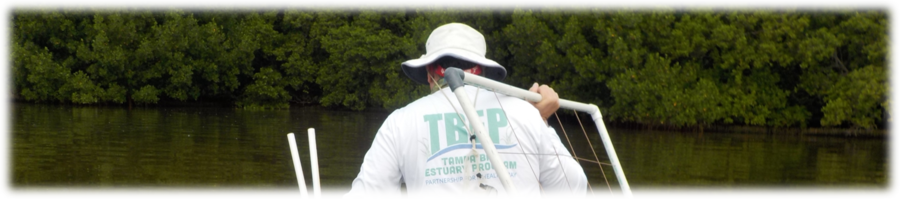
```

Seagrass is an important habitat for fish and other marine animals. It stabilizes sediment, produces oxygen, and reduces shoreline erosion. The coverage, species, and condition of seagrass are significant indicators of ecosystem health in Tampa Bay.  Over the past 40 years, reductions in nutrient pollution by partners throughout the watershed have significantly improved water clarity, leading to increases in seagrass.

Each year, TBEP partners collect seagrass transect data at fixed locations in Tampa Bay.  These data are used to inform progress on achieving bay goals for seagrass habitat restoration.  Data have been collected since the mid 1990s and are hosted online at the [Tampa Bay Water Atlas](https://www.tampabay.wateratlas.usf.edu/) by the University of South Florida Water Institute.  These data represent nearly thirty years of field sampling and include several thousand records on seagrass condition.  This dashboard provides access to these data through a series of tabs that present synthesized results from the raw data. The dashboard is arranged as follows:

1) [__SUMMARIES__](#summaries): View stoplight graphic and changes over time by major bay segments
1) [__INDIVIDUAL TRANSECTS__](#individual-transects): View results for individual transects
1) [__SEAGRASS EDGE__](#seagrass-edge): View results for estimates of the maximum seagrass edge for individual transects (experimental)
1) [__DATA DOWNLOADS__](#data-downloads): Download transect data and metadata

Some of the plots in this dashboard are interactive and display options can be controlled using a mouse. Most plots include a [control menu](https://help.plot.ly/zoom-pan-hover-controls/) on the top with different options for viewing the data.  For example, click the camera icon to download a png file for a plot.

<br>
```{r, fig.align='center', out.width='30%'}
knitr::include_graphics('www/plotcontrols.PNG')
```
<br>

#### Website information

<a href="https://tbep-tech.github.io/tbeptools/" target="__blank" rel="noopener noreferrer"></a>

The page source content can be viewed on [Github](https://github.com/tbep-tech/seagrasstransect-dash). Nearly all of the data, tables, and plots were created using functions in the [tbeptools](https://tbep-tech.github.io/tbeptools) R software package.  Please see the [vignette](https://tbep-tech.github.io/tbeptools/articles/seagrasstransect.html) for a detailed overview of how you can use these functions on your own to work with the data. 

Technical questions about the seagrass transect data can be sent to [Sheila Scolaro](mailto:sscolaro@tbep.org).  Questions and comments about the dashboard can be sent to [Marcus Beck](mailto:mbeck@tbep.org).

Like this app? Share it on social media using the [\#TampaBayOpenSci](https://twitter.com/hashtag/TampaBayOpenSci?src=hashtag_click) hashtag.  

Citation info here: [](https://zenodo.org/badge/latestdoi/319050934)

<br>
```{r, fig.align='center', out.width = '50%'}
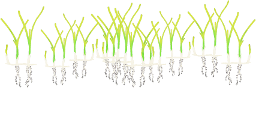
```

<center><p style="font-size:12px">Seagrass graphics courtesy of the Integration and Application Network, University of Maryland Center for Environmental Science ([ian.umces.edu/symbols/](https://ian.umces.edu/symbols/)).</p></center>

</div>
<div class = "col-md-2"></div>
</div>

1 SUMMARIES {data-navmenu="PAGE SELECTION"}
===========================================================

Column {.tabset .tabset-fade data-width=200}
-----------------------------------------------------------------------

### TRANSECT LOCATIONS

```{r}
cols <- c("#E16A86", "#CB7F2F", "#9F9400", "#50A315", "#00AC79", "#00AAB7", "#009ADE", "#A87BE4", "#DA65C3")

mapview::mapview(trnpts, zcol = 'MonAgency', lwd = 0, legend = F, homebutton = F, col.regions = cols) + 
  mapview::mapview(trnlns, zcol = 'MonAgency', homebutton = F, layer.name = 'Monitoring Agency', lwd = 4, color = cols)
```

### USING THIS TAB

This tab can be used to view the seagrass transect stoplight graphic (left plot) and changes over time by major bay segments (right plot).  The __TRANSECT LOCATIONS__ tab on the top left shows the transect locations and responsible monitoring agency. 

The major bay segments shown in each plot are as follows:

* __OTB__: Old Tampa Bay
* __HB__: Hillsborough Bay
* __MTB__: Middle Tampa Bay
* __LTB__: Lower Tampa Bay
* __BCB__: Boca Ciega Bay

The seagrass species include the five dominant species found in Tampa Bay: 

* *Halodule wrightii*: shoal grass
* *Syringodium filiforme*: manatee grass
* *Thalassia testudinum*: turtle grass
* *Halophila engalmanii*: star grass
* *Ruppia maritima*: widgeon grass

The __report card__ provides an assessment of relative health of seagrasses in each of the major bay segments, including a baywide assessment in the Tampa Bay column.  The color categories (white to dark blue) are based on average frequency occurrence estimates across all seagrass species in each segment.  Darker blue means higher frequency occurrences (healthy seagrass) and white means lower frequency occurrences (less healthy seagrass).  

The __changes over time__ plot on the right shows similar information as the report card, except the frequency occurrence estimates are shown separately for each species.  Additionally, the estimates are grouped across the segment selection.  Removing a segment at the top will update the plot to show only frequency occurrence estimates for the selected segments.  Likewise, adding or removing species from the selection at the top will add or remove a species from the plot.  

The buttons on the top can be used to select the information shown in each plot. The segment selection buttons can be used to pick which segments are shown in each plot. Click on a label and press the backspace key on your keyboard to remove a segment.  Below, the BCB (Boca Ciega Bay) segment is selected.  It will be removed by hitting the backspace key. 

<br>
```{r, fig.align = 'center', out.width = '70%'}
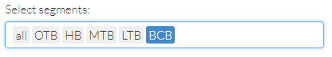
```
<br>

After a selection is removed, it appears in the dropdown menu.  Clicking on the text adds it back to the selection. 

<br>
```{r, fig.align = 'center', out.width = '70%'}
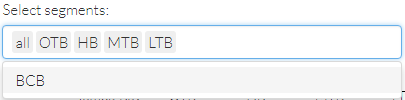
```
<br>

Similarly, species can be added or removed from the right plot by changing the selection. Below, Halodule is selected and ready to be removed by hitting the backspace key on your keyboard. Caulerpa (attached macroalgae) and Dapis (cyanobacteria) can also be selected, although estimates are unreliable prior to 2021.

<br>
```{r, fig.align = 'center', out.width = '70%'}
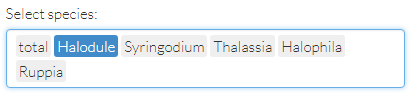
```
<br>

Finally, the year range can be selected from the slider on the top right.  By default, the entire date range when seagrass transect data are available is shown.  This slider affects both plots. 

<br>
```{r, fig.align = 'center', out.width = '70%'}
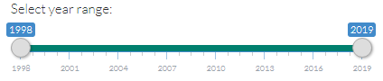
```
<br>

<br>
```{r, fig.align='center', out.width = '50%'}
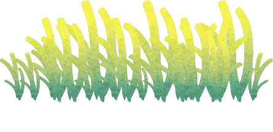
```
<br>

Column {data-width=500}
-----------------------------------------------------------------------

### REPORT CARD MATRIX AND FREQUENCY OCCURRENCE OVER TIME

```{r}
fillCol(flex = c(0.1, 1),
  fillRow(
    selectInput(inputId = 'segsel1', label = 'Select segments (backspace to remove):', choices = c('all', segs), selected = c('all', segs), selectize  = T, multiple = T, width = '90%'),
    selectInput(inputId = 'sppsel1', label = 'Select species (backspace to remove):', choices = c('total', spp), selected = c('total', spp[1:5]), selectize = T, multiple = T, width = '90%'), 
    sliderInput(inputId = 'yrssel1', label = 'Select year range:', min = 1998, max = 2024, value = c(1998, 2024), step = 1, sep = '', width = '90%')
  ),
  fillRow(flex = c(0.5, 1),
    plotly::renderPlotly(matplo()),
    plotly::renderPlotly(aveplo())
  )
)
```

2 INDIVIDUAL TRANSECTS {data-navmenu="PAGE SELECTION"}
===========================================================

Column {.tabset .tabset-fade data-width=200}
-----------------------------------------------------------------------

### MAP SELECTION

```{r}
output$mapplo <- leaflet::renderLeaflet(m)
leaflet::leafletOutput('mapplo')
```

### USING THIS TAB

This tab shows results for individual transects.  The plots show detailed information for all dates, species, and sites (quadrats) for the selected transect. 

The locations and names of the transects are shown in the __MAP SELECTION__ tab (top left). The selected transect is shown as a red dot on the map and is chosen from the dropdown menu at the top left on the right panel. 

<br>
```{r, fig.align = 'center', out.width = '70%'}
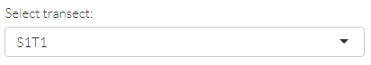
```
<br>

```{r, fig.align = 'center', out.width = '80%'}
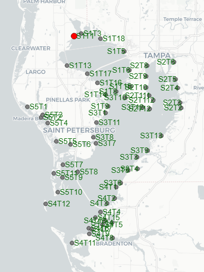
```
<br>

The seagrass species shown in the plots include the five dominant species found in Tampa Bay: 

* *Halodule wrightii*: shoal grass
* *Syringodium filiforme*: manatee grass
* *Thalassia testudinum*: turtle grass
* *Halophila engalmanii*: star grass
* *Ruppia maritima*: widgeon grass

The __top plot__ shows seagrass abundances for each species, for each date, and at each location along the selected transect (in meters).  This plot provides a detailed assessment of where species were located on a transect and how those locations may have changed over time.  The species are color-coded as shown in the legend.  Each point is sized by the recorded abundance for a species (as Braun-Blanquet, 0-5).  Points that were sampled but had no seagrass are shown as small grey points.

The __bottom plot__ plot shows similar information as the top plot, except the observations for each species along a transect for a given date are shown as overall frequency occurrence estimates.  This can be conceptualized as aggregating the data in the top plot along the x-axis and rotating the plot ninety degrees.  Each vertical grey line in the plot is a sample date.  The plot provides an aggregated assessment of how species abundances are changing over time and which species are dominant at a transect. 

The buttons on the top can be used to select the information shown in each plot. The transect selection is a simple dropdown menu. 

<br>
```{r, fig.align = 'center', out.width = '70%'}

```
<br>

Species can be added or removed from both plots by changing the selection in the top middle selector. Below, Halodule is selected and ready to be removed by hitting the backspace key. Caulerpa (attached macroalgae) and Dapis (cyanobacteria) can also be selected, although estimates are unreliable prior to 2021.

<br>
```{r, fig.align = 'center', out.width = '70%'}
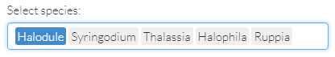
```
<br>

After a selection is removed, it appears in the dropdown menu.  Clicking on the text adds it back to the selection. 

<br>
```{r, fig.align = 'center', out.width = '70%'}
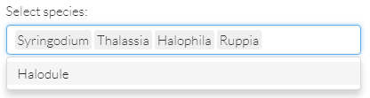
```
<br>

Finally, the year range can be selected from the slider on the top right.  By default, the entire date range when seagrass transect data are available is shown.  This slider affects both plots. 

<br>
```{r, fig.align = 'center', out.width = '70%'}

```
<br>

<br>
```{r, fig.align='center', out.width = '50%'}
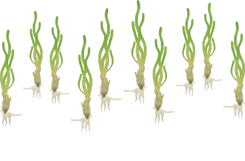
```
<br>

Column {data-width=500}
-----------------------------------------------------------------------

### RESULTS BY TRANSECT

```{r}
fillCol(flex = c(0.1, 1),
  fillRow(
    HTML('<b>Select a transect by clicking a marker on the map</b>'),
    selectInput(inputId = 'sppsel2', label = 'Select species (backspace to remove):', choices = spp, selected = spp[1:5], selectize = T, multiple = T, width = '90%'), 
    sliderInput(inputId = 'yrssel2', label = 'Select year range:', min = 1998, max = 2024, value = c(1998, 2024), step = 1, sep = '', width = '90%')
  ),
  fillCol(flex = c(1, 1),
    plotly::renderPlotly(trnplo()),
    plotly::renderPlotly(sumplo())
  )
)
```

3 SEAGRASS EDGE {data-navmenu="PAGE SELECTION"}
===========================================================

Column {.tabset .tabset-fade data-width=200}
-----------------------------------------------------------------------

### USING THIS TAB

This is an experimental tab to view estimates of the maximum seagrass edge for individual transects.  Plots in this tab are based on seagrass presence/absence data at each transect referenced with a consistent [bathymetric](https://www.ngdc.noaa.gov/mgg/bathymetry/estuarine/) (bottom depth) data layer for Tampa Bay.  Methods in this tab attempt to estimate the location on the transect where abundance declines rapidly.  This location is then matched with the depth value from the bathymetric layer.  Comparing multiple estimates over time provides an assessment of how the seagrass edge has changed.  Increases or decreases in the seagrass depth edge may suggest water quality changes that can negatively impact seagrasses. 

The __DEPTH BY DISTANCE__ tab shows depth (cm) against transect position (m) at every date for the selected transect.  Transect sampling points with seagrass present are in green and with seagrass absent are in red. Green points are also sized by relative abundance (average Braun-Blanquet for all species).  Data for each date provide the basis for assessing the seagrass depth edge. 

The __DATE RESULTS__ tab shows data for a selected date for the selected transect. The two plots in this tab demonstrate how the seagrass edge is estimated.  The left plot shows mean abundance against transect position.  If possible, a logistic curve is estimated for these data to approximate the theoretical decrease in abundance as sampling progresses along the transect (black curve).  If a curve is estimated, a linear curve is fit through the inflection point on the downslope of the logistic curve.  This represents the point of maximum decrease in abundance with location. Although seagrass can occur beyond this limit, it represents a physiological limit beyond which abundance is in constant decline with depth.  The vertical line with shaded areas is this limit +/- 95% confidence. The right plot shows the same results but linking the site limit line to depth.  The two are transposed using a linear regression fit between depth and transect position.  The horizontal red line with shaded areas is the seagrass edge estimate +/- 95% confidence. 

<br>
```{r, fig.align = 'center', out.width = '100%'}
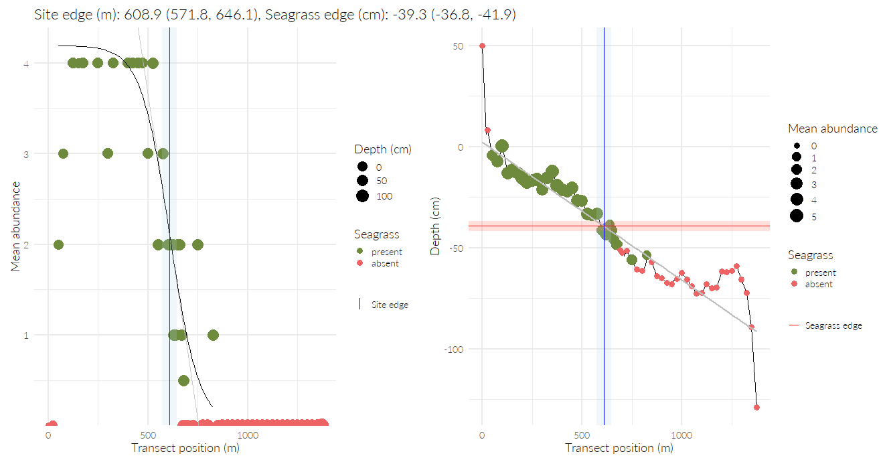
```
<br>

The __EDGE TRENDS BY SITE__ tab shows the trends in the seagrass edge estimates over time where estimation was possible. The black points with 95% confidence intervals are the seagrass edge estimates from the horizontal red lines in the second tab.  If sufficient estimates are available, this plot can be used to determine if the edge estimates are changing over time. The vertical ticks on the x-axis show sample dates to provide a comparison to the available edge estimates.

The transect selection is made from the top dropdown menu.  The date selection only applies to the second tab.    

<br>
```{r, fig.align = 'center', out.width = '70%'}

```
<br>

<br>
```{r, fig.align='center', out.width = '60%'}
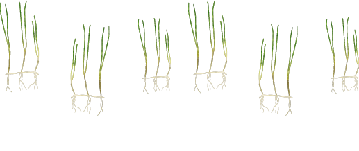
```
<br>

Column {data-width=500, .tabset .tabset-fade}
-----------------------------------------------------------------------

<br>
```{r}
column(12,
  selectInput(inputId = 'trnsel2', label = 'Select transect:', choices = demtrns, selected = demtrns[1])
)
```

### DEPTH BY DISTANCE

```{r}
renderPlot(demplo())
```

### DATE RESULTS

```{r}
fillCol(flex = c(NA, 1),
  renderUI({
    
    demdat <- demdat()
    
    req(demdat)
    
    dts <- sort(unique(demdat$Date))
    
    selectInput(inputId = 'dtssel1', 'Select date:', choices = dts)
    
  }), 
  renderPlot(dtdemplo())
)
```

### EDGE TRENDS BY SITE

```{r}
renderPlot(alledgplo())
```

4 DATA DOWNLOADS {data-navmenu="PAGE SELECTION"}
===========================================================

Column {.tabset .tabset-fade data-width=650}
-----------------------------------------------------------------------

### COMPLETE TRANSECT DATA

```{r}
fillCol(flex = c(NA, 1),
  shinyWidgets::downloadBttn('dltrantab', 'Download data', style = 'simple', block = T, color = 'success'),
  reactable::renderReactable(rcttrantab())
  )
```

### SUMMARIZED FREQUENCY OCCURRENCE DATA

```{r}
fillCol(flex = c(NA, 1),
  shinyWidgets::downloadBttn('dltranocctab', 'Download data', style = 'simple', block = T, color = 'success'),
  reactable::renderReactable(rcttranocctab())
  )
```

### TRANSECT LOCATIONS

```{r}
fillCol(flex = c(NA, 1),
  shinyWidgets::downloadBttn('dltrnptstab', 'Download data', style = 'simple', block = T, color = 'success'),
  reactable::renderReactable(rcttrnptstab())
  )
```

### METADATA

__Complete transect data__: Minimally altered raw transect data for every transect and site (quadrat) along each transect.  

* *Date*: Sample date in YYYY-MM-DD
* *Transect*: Transect name
* *Site*: Quadrat location along each transect, meters
* *Depth*: Site depth, meters. Should be negative values below the water surface.
* *Savspecies*: Relevant seagrass genus, also includes AA (attached algae, multiple types including Caulerpa), DA (drift algae), cyanobacteria (Dapis), and no cover. Estimates for Caulerpa and Dapis are unreliable prior to 2021.
* *SeagrassEdge*: Depth of seagrass edge, cm
* *var*: Measured variable, one of abundance, blade length, or short shoot density
* *aveval*: Average value for the measured variable (multiple quadrats at a site depending on variable), unitless if abundance, cm if blade length, shoots per square meter if short shoot density
* *sdval*: Standard deviation for the measured variable, same units as in aveval

__Summarized frequency occurrence data__: Summarized data at each transect and date, aggregating information across sites (quadrats).

* *Date*: Sample date in YYYY-MM-DD
* *Transect*: Transect name
* *Savspecies*: Relevant seagrass genus, also includes AA (attached algae), DA (drift algae), and no cover
* *nsites*: Number of sites (quadrats) at each transect/date, repeated across rows  
* *foest*: Frequency occurrence estimate for the whole transect for the species, from 0 - 1
* *bbest*: Abundance (Braun-Blaunquet) average across sites (quadrats) for the species, from 0 - 5

__Transect locations__: Transect location data (EPSG 4326), including responsible monitoring agency

* *Transect*: Transect name
* *lat_dd*: Latitude in decimal degrees
* *lon_dd*: Longitude in decimal degrees
* *mon_agency*: Responsible monitoring agency for collecting data at the transect
* *bay_segment*: Bay segment where the transect is located

<br>
```{r, fig.align='center', out.width = '25%'}

```
<br>

